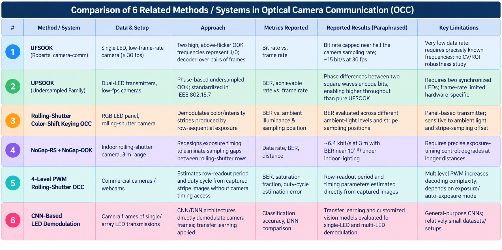

# 1. Core Domain Concepts ( In Project Context)

## Computer Vision

- **Frame extraction & ROI localization/tracking:** Isolating and following the transmitter's pixels across frames, even under motion, occlusion or scale change.
- **Blob/contour detection, template matching:** Common ways to auto-locate a light source without manual selection.
- **Rolling-shutter geometry:** A CMOS sensor exposes rows sequentially rather than all at once, so a single frame can encode *sub-frame* temporal information as horizontal stripes — this is a CV problem as much as a signal one.

## Optical / Visible Light Communication (OCC/VLC)

- **On-Off Keying (OOK):** The base modulation — light on = 1, off = 0 (or vice versa).
- **Undersampled modulation schemes (UFSOOK, UPSOOK):** Designed specifically because camera frame rates (30–60 fps) are far below usable LED switching speeds; they trade rate for compatibility with low-frame-rate cameras. These schemes generate a flicker-free high-frequency carrier and lower the effective symbol rate to match the camera's frame rate.
- **Rolling-shutter stripe decoding:** Exploits the per-row exposure offset to sample the LED signal many times within a single frame, at the cost of complex geometric calibration. Stripe widths can vary substantially at high modulation frequencies, and LED capacitive switching effects can make the stripes asymmetric, degrading reliability.
- **Line coding / framing:** DC-balanced codes (Manchester, 4B6B, 8B10B) used in VLC standards to keep average brightness constant and add flicker/dimming control. These fixed-length constrained-sequence codes are used in VLC standards to support dimming control and reduce perceptible flicker.
- **IEEE 802.15.7 (OWC standard):** Formalizes several low-frame-rate OCC PHY modes, including undersampled schemes. The 2018 revision of this standard confirmed multiple modulation schemes for low-frame-rate OCC across several PHY layers.

## Signal Processing

- **Sampling & aliasing:** The camera's frame rate acts as a sampling clock; if it isn't synchronized to the transmitter's symbol clock, naive per-frame thresholding fails — this is the crux of "symbol synchronization" in your pipeline.
- **Adaptive thresholding & detrending:** Needed because ambient light, auto-exposure, and distance change the DC level and gain of the intensity signal over time.
- **Forward error correction / interleaving:** Used in some OCC systems to recover bits lost to inter-frame gaps. Interleaved coding schemes have been proposed to compensate for the time gap between consecutive camera frames.

## AI/ML

- **CNNs as symbol classifiers:** Replacing hand-tuned thresholds with a learned mapping from image patches (or stripe patterns) to bit values.
- **Transfer learning:** Reusing ImageNet-style backbones and fine-tuning on small, task-specific OCC datasets, since labeled OCC video is scarce.
- **CNN-based light-source localization:** Using detection networks instead of classical blob detection for the ROI-finding step, especially in cluttered or moving scenes.

# 2. Comparison of Related Methods / Systems

> **Note (2026-09-10, audit):** ten papers were reviewed for Week 1 (Danakis 2012; Roberts 2013; Luo 2014; Nguyen 2015; Ji 2014; Chow 2015 / Liu 2016; Chuang 2019; Hsu 2020; Peng 2023; Saeed 2019 — listed in the Week-1 review deck). Six *systems* are tabulated above. The Day 03 slide's "10 methods" counts the papers; the table counts systems. The row references in §3 below originally pointed at a 10-row draft of this table and have been re-pointed at the 6-row table that is actually in the repository.

# 3. Shortlisted Candidate Methods for This Project

Given the brief's own instruction (**software-only, offline, dataset-driven, no hardware assumptions about modulation scheme**), the shortlist should be *techniques adaptable to whatever the supplied videos actually contain*, not full OCC transmitter/receiver protocols:

## 1. Fixed-Threshold Baseline

**Global or per-video static intensity threshold** (mean, Otsu, or midpoint of min/max) applied to the extracted intensity signal, informed by rows 1–2 (UFSOOK, UPSOOK), which show OOK as the base modulation in nearly all reviewed systems.

Fast, simple, but brittle to ambient-light drift and auto-exposure changes (limitation noted in rows 3 and 5).

## 2. Adaptive / Signal-Processing Pipeline

**Rolling or windowed threshold, detrending (high-pass or moving-average subtraction) plus symbol-boundary/clock recovery**, directly modeled on how undersampled-modulation systems (rows 1, 2) and rolling-shutter systems (rows 3, 4, 5) recover timing without hardware synchronization.

This is the natural **"main" baseline** given the project scope.

## 3. Simple ML-Assisted Symbol Classifier

A lightweight classifier (**Logistic Regression / small CNN / SVM on windowed intensity features**) trained where per-symbol or per-message labels exist, following the pattern in row 6, but scaled down since the project has **4 weeks** and a modest, faculty-provided dataset rather than a purpose-built large corpus.