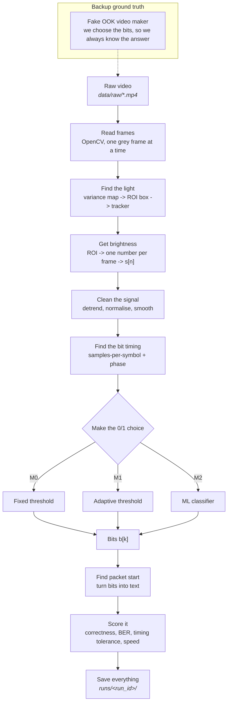

# Day 05 — Workflow Design

**Project:** Optical Camera Communication (OCC) Video Message Decoding

**What this file is:** the plan for how we go from a raw video file to a final score. It has the pipeline flowchart, the method definitions, the metrics, and the folder layout.

**Other files:** `EXPERIMENT_PLAN.MD` says which experiments we run. `EXPERIMENT_LOG.MD` is where we write down what happened.

**Important note:** we do not have the faculty dataset yet. So this plan does not depend on it. Wherever a real number is still unknown, it says `TBD`. It does not guess. We also build a fake (synthetic) video maker, so we can build and test everything before the real videos arrive.

---

## 1. Pipeline Flowchart

### 1.1 The stages



### 1.2 Plain text version

```
raw video
   |
   v
[1] read frames        -> grey frames
   |
   v
[2] find the light     -> a box (ROI) for each frame
   |
   v
[3] get brightness     -> s[n], one number per frame
   |
   v
[4] clean the signal   -> s'[n], flat and noise-free
   |
   v
[5] find bit timing    -> how many frames per bit, and where bits start
   |
   v
[6] decide 0 or 1      -> b[k], the bits
   |
   v
[7] bits to message    -> the text
   |
   v
[8] score it           -> metrics.json + plots
```

### 1.3 What each stage saves

Each stage saves its output to a file. This means we can re-run any one stage without redoing the ones before it. This is the main reason the workflow is repeatable.

| Stage | What it saves | File type | Where |
|---|---|---|---|
| 1–2 | The ROI box for each frame | CSV: `frame,x,y,w,h,conf` | `data/interim/<video_id>/roi.csv` |
| 3 | Raw brightness values | NPY float32 `(N,)` + `meta.json` | `data/interim/<video_id>/intensity.npy` |
| 4 | Cleaned brightness values | NPY float32 `(N,)` | `runs/<run_id>/signal_pre.npy` |
| 5 | Timing guess | JSON: `sps_hat`, `phase_hat`, `method` | `runs/<run_id>/timing.json` |
| 6 | The bits | Text, one line of `0`/`1` | `runs/<run_id>/bits.txt` |
| 7 | The message | UTF-8 text | `runs/<run_id>/message.txt` |
| 8 | The scores | JSON (see §4.6) | `runs/<run_id>/metrics.json` |

**Rule:** `data/raw/` is read-only. No script is ever allowed to write there.

Stages 1–3 are the same for every method, so we save them once per video and reuse them. Stages 4–8 change per method, so we save them per run.

---

## 2. The Three Methods

Three methods. Each one adds only one new idea over the one before it. That way, if a score improves, we know what caused it.

### M0 — Fixed threshold (the baseline)

This one is meant to be simple, not good. It gives us a floor to compare against.

| Part | What it does |
|---|---|
| ROI | One fixed box, set by hand in the config file |
| Brightness | Average of the grey pixels inside the box |
| Cleaning | None |
| Timing | Assumed known: `sps = fps / symbol_rate`, taken from the config. Phase = 0 |
| Decision | One threshold for the whole video: `T = (min + max) / 2`. For each bit window, take the majority vote of `s[n] > T` |
| Packets | None. It just prints the raw bits |

Where we expect it to break (we still have to check, not assume): if the room light or the camera exposure changes, the whole signal shifts up or down, and one fixed `T` starts cutting in the wrong place. Also, if the assumed `sps` is even slightly wrong, the error builds up and the end of the message turns to noise.

### M1 — Adaptive signal processing (the main method)

This is the real method for the project.

| Part | What it does |
|---|---|
| Find the light | Build a **variance map**: for each pixel, measure how much it changes over the first `K` frames. The blinking light changes the most, so it stands out. If nothing stands out, fall back to the box from the config |
| Track the light | Re-check the centre every `M` frames, use an OpenCV CSRT tracker in between, and re-start it if it looks lost |
| Brightness | Average of only the brightest `p`% of pixels in the box, so dark background pixels do not water down the signal |
| Detrend | Subtract a moving average with a long window `W_d`. This removes slow drift |
| Normalise | Rolling z-score or rolling min–max over window `W_n` |
| Smooth | Optional Savitzky–Golay or short moving average, window `W_s`, kept shorter than one bit |
| Timing — rate | Use the autocorrelation peak or the FFT peak of the changes in the signal to guess `sps_hat` |
| Timing — phase | Try every start offset from 0 to 1 bit in small steps. Keep the one where the 0s and 1s are furthest apart |
| Decision | Rolling median as the threshold, plus a Schmitt trigger (hysteresis) so the output does not flicker near the middle |
| Packets | If a preamble exists, find it by cross-correlation. Even if we do not know the preamble, report the best match as a hint |

### M2 — ML classifier (only if we can)

**This runs only if we have labels.** The exact condition is Gate G4 in §5.

| Part | What it does |
|---|---|
| Input | A window of `s'` around each bit centre, about `1.5 * sps_hat` long, resized to a fixed length `L` |
| Features | The window itself, plus mean, std, slope, min, max, and a few FFT values |
| Models | Logistic regression, then RBF SVM, then a small 1-D CNN. Stop at the first one that beats M1 |
| Splitting | **Split by video.** All frames of one video go either fully in train or fully in test. Never split inside a video |
| Checking | Grouped k-fold on the training videos. Report the final number once, on held-out videos |
| Also report | Training time, test time per video, and how many labelled bits we had |

If we only get one label per whole message (and not per bit), we cannot train per-bit directly. The backup plan: take M1's confident answers on videos it decoded perfectly, and use those as labels. But then M2 is just copying M1, not competing with it. We say that clearly in the results instead of hiding it.

---

## 3. The Project's Own Experiment

Look at the Day 02 comparison table. The older systems report bit rate and BER for their own setup. Row 1 even lists "no CV/ROI robustness study" as a gap. The CNN work is tested on small custom datasets.

So our own experiment is not "decode the video" — that is just the basic job. It is:

> **Measure how much the ROI, the cleaning settings, the threshold, and the timing guess can be wrong before decoding fails. Report a range that still works, not one single accuracy number. Then compare that range for the classical method and the ML method.**

This matches the Day 03 research question and produces the sensitivity curves listed there. The exact sweeps are in `EXPERIMENT_PLAN.MD`.

---

## 4. How We Score It

### 4.1 Message correctness

- **MCR (message correctness rate)** = out of all test videos, how many gave the exact right message. This is the headline number.
- **NED (normalised edit distance)** = `Levenshtein(decoded, truth) / len(truth)`. We report this too, because MCR alone cannot tell the difference between "one letter wrong" and "complete nonsense".

### 4.2 Bit error rate (BER)

- `BER = number of wrong bits / total bits`. Only where we have the true bits.
- **Lining up the streams:** the decoded bits may start a bit early or late. So we try offsets from `-32` to `+32`, take the lowest BER, and write down which offset we used.
- **Important warning:** BER only counts swapped bits. If the timing slips, we get extra or missing bits instead, and then BER goes near 0.5 even when the decoder was mostly right. So every BER is reported with its offset, its length difference, and its NED next to it.

### 4.3 Timing robustness

We report ranges, not one number:

- **Phase tolerance:** shift the bit start `φ` from `-0.5` to `+0.5` of a bit, in steps of 0.05. Report how wide the range is where `BER ≤ 0.01`.
- **Rate tolerance:** change the assumed `sps` from `-10%` to `+10%`, in steps of 1%. Report how wide the working range is.
- **Rate error:** `|sps_hat − sps_true| / sps_true`, when we know the true value (fake videos, or faculty metadata).

### 4.4 Speed

- Seconds per video, start to finish. Also milliseconds per frame.
- Take the **middle of 3 runs**, on the same machine. The machine details go in the log header once.
- Split by stage (reading / ROI / timing / decision) so we can see what is slow.
- For M2, training time is reported on its own. It is never mixed into the per-video number.

### 4.5 Sensitivity

For each setting we sweep, we draw a curve of BER against that setting, and read the working range off it. Settings we sweep: ROI size, ROI position, smoothing window, detrend window, threshold shift, timing phase, and assumed `sps`. Grids are in `EXPERIMENT_PLAN.MD`.

### 4.6 What `metrics.json` looks like

```json
{
  "run_id": "2026-09-09T14-22-05_a1b2c3d",
  "git_commit": "a1b2c3d",
  "config_path": "configs/m1_adaptive_sp.yaml",
  "video_id": "vid_003",
  "video_sha256": "…",
  "method": "M1",
  "n_frames": 1200,
  "fps": 30.0,
  "sps_estimated": 4.02,
  "sps_assumed_truth": null,
  "phase_estimated": 0.31,
  "message_decoded": "…",
  "message_truth": "…",
  "message_exact_match": true,
  "normalized_edit_distance": 0.0,
  "ber": 0.0031,
  "ber_alignment_offset": -2,
  "bits_decoded": 480,
  "bits_truth": 480,
  "runtime_total_s": 12.4,
  "runtime_per_frame_ms": 10.3,
  "runtime_by_stage_s": {"extract": 3.1, "roi": 4.0, "sync": 1.2, "decision": 0.4},
  "params": {"W_d": 51, "W_n": 101, "W_s": 3, "roi_scale": 1.0},
  "notes": ""
}
```

Every run writes this file. The result tables in the weekly slides are built **from** these files by `scripts/make_report.py`. We never type numbers by hand. This is the single most important rule in the project.

---

## 5. Go / No-Go Gates

Clear checkpoints, decided now, so we cut work based on evidence and not on panic in Week 4.

| Gate | Pass condition | What to do if it fails |
|---|---|---|
| G1 — data is usable | At least one video shows a clear two-level pattern or a clear frequency peak | Report this as a real finding, show faculty the plots, keep working on fake data |
| G2 — M0 runs | The baseline produces bits on every video without crashing | Fix this first. Do not start M1 on a broken setup |
| G3 — M1 beats M0 | M1 has lower BER than M0 on most videos | Find out which stage is at fault (timing or decision) before adding anything new |
| G4 — M2 allowed | We have per-bit or per-symbol labels, **or** M1 perfectly decodes 5+ videos we can use as labels | Skip M2. Do more sensitivity work instead, and write down why |
| G5 — sensitivity study | M1 works at least somewhat on one real video | Run the sweeps on fake data only, and label them clearly as fake everywhere |

---

## 6. Folder Structure

```
occ-decoder/
├── README.md                    # what it is, how to run it, how to reproduce it
├── requirements.txt             # pinned versions
├── environment.yml              # conda option
├── Makefile                     # make synth | baseline | sweep | report | test
├── .gitignore                   # ignores data/raw, runs/, *.mp4, __pycache__
│
├── configs/                     # one file fully describes one run
│   ├── default.yaml
│   ├── m0_fixed_threshold.yaml
│   ├── m1_adaptive_sp.yaml
│   ├── m2_ml_classifier.yaml
│   └── sweeps/
│       ├── sweep_roi.yaml
│       ├── sweep_timing.yaml
│       └── sweep_threshold.yaml
│
├── data/
│   ├── raw/                     # READ-ONLY. Faculty videos. Never changed, never committed.
│   │   └── MANIFEST.csv         # video_id, filename, sha256, fps, resolution, source, notes
│   ├── synthetic/               # fake videos + the bits we put in them
│   ├── interim/                 # saved ROI + brightness per video
│   │   └── <video_id>/
│   │       ├── roi.csv
│   │       ├── intensity.npy
│   │       └── meta.json
│   └── ground_truth/            # true bits / messages, where we have them
│       └── <video_id>.json
│
├── src/occ/
│   ├── __init__.py
│   ├── cli.py                   # one entry point: decode, sweep, synth, report
│   ├── io/
│   │   ├── video.py             # reading frames, checking fps
│   │   └── artifacts.py         # saving and loading the files in §1.3
│   ├── roi/
│   │   ├── localize.py          # variance map, picking the blob
│   │   └── track.py             # CSRT tracking, restarting when lost
│   ├── signal/
│   │   ├── extract.py           # ROI -> one number
│   │   ├── preprocess.py        # detrend, normalise, smooth
│   │   └── sync.py              # guessing sps and phase
│   ├── decode/
│   │   ├── threshold.py         # M0 fixed, M1 adaptive
│   │   ├── framing.py           # preamble search, unpacking
│   │   └── message.py           # bits -> text
│   ├── ml/
│   │   ├── features.py
│   │   ├── train.py             # split-by-video is enforced here
│   │   └── infer.py
│   ├── eval/
│   │   ├── metrics.py           # MCR, NED, BER, working ranges
│   │   ├── sweeps.py            # running the parameter grids
│   │   └── plots.py             # sensitivity curves
│   └── synth/
│       └── generate.py          # fake OOK video maker
│
├── scripts/
│   ├── run_pipeline.py
│   ├── run_sweep.py
│   ├── make_synthetic.py
│   └── make_report.py           # runs/*/metrics.json -> tables + figures
│
├── notebooks/                   # for looking around only, never the real source
│   ├── 01_first_look_at_dataset.ipynb
│   └── 02_intensity_signal_inspection.ipynb
│
├── runs/                        # one folder per run, gitignored, never edited by hand
│   └── <run_id>/
│       ├── config.yaml          # the exact config that was used
│       ├── metrics.json
│       ├── bits.txt
│       ├── message.txt
│       ├── signal_pre.npy
│       ├── timing.json
│       ├── figures/
│       └── log.txt
│
├── experiments/
│   ├── EXPERIMENT_PLAN.MD
│   └── EXPERIMENT_LOG.MD
│
├── reports/
│   ├── week1/ … week4/
│   └── figures/                 # only generated figures, all rebuildable
│
└── tests/
    ├── test_metrics.py          # BER lining up, edit distance
    ├── test_sync.py             # sps recovery on fake signals we know the answer to
    └── test_pipeline_smoke.py   # full run on a 2-second fake clip
```

### Run ID format

`<timestamp>_<short git sha>` — for example `2026-09-09T14-22-05_a1b2c3d`. If the git sha ends in `-dirty`, the run is marked in the log as not reproducible.

### Rules that keep it reproducible

1. Never pass a setting as a loose number on the command line for a real experiment. Put it in a config file, and copy that config into `runs/<run_id>/config.yaml`.
2. Set `random_seed` in every config and save it in `metrics.json`.
3. Save each raw video's SHA-256 in `data/raw/MANIFEST.csv`, so if a file is quietly swapped we can tell.
4. Build all tables and figures from `runs/*/metrics.json`. A hand-typed number counts as a bug.
5. Do not log a run made on uncommitted code, or mark it clearly as `dirty`.

### Reproduce in three commands (this goes in `README.md`)

```bash
make setup                                    # install the pinned packages
make synth                                    # make fake videos + their true bits
python -m occ.cli decode --config configs/m1_adaptive_sp.yaml --video-set synthetic
make report                                   # rebuild all tables and figures
```

---

## 7. What We Still Do Not Know

These come from the Week 1 blockers. They decide which parts of this plan stay guesses.

| Unknown | What it blocks | What we do until we know |
|---|---|---|
| Camera fps and transmitter symbol rate | `sps` in M0, and the search range in M1 | Use fake videos with many different fps / symbol-rate ratios |
| Do we get true bits, and at what level | BER, and M2 completely | Fake videos always have perfect truth |
| Does the light move in the frame | Whether tracking in M1 is needed or useless | Write the tracking, but keep it off by default in the config |
| Packet / framing structure | `decode/framing.py` | Print the raw bits, and run preamble search as a hint only |
| Rolling shutter or global shutter | Whether we can read stripes inside one frame | Assume one sample per frame. Stripe decoding is out of scope unless the videos show stripes |
| Codec / compression damage | Whether the brightness signal needs fixing | Add a re-encode sweep (different CRF values) to the sensitivity study |
