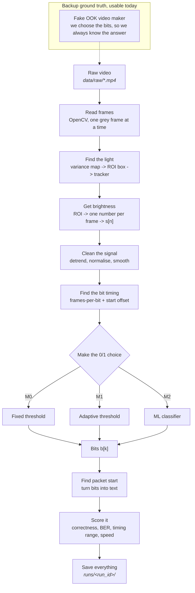

# Day 06 — Reproducible Workflow Package
**Name:**Keshav Prasad 

**Project:** Optical Camera Communication (OCC) Video Message Decoding
**Status:** dataset not received. Everything here is designed to work without it.

**What this file is:** all four Day 06 deliverables in one place — pipeline flowchart, experiment plan, log template, and folder structure. It can be read on its own. The full-length versions live in `EXPERIMENT_PLAN_V2.MD` and `EXPERIMENT_LOG.MD`.

---

## 0. Note on Scope

These four deliverables are the same four set for Day 05. This version is not a copy. It adds the things we learned while writing the methodology package:

| Added since Day 05 | Why |
|---|---|
| DEV / TEST / FAKE data roles | The old plan never said which videos each experiment was allowed to touch |
| E00 data readiness check | Nothing on real data counts until every video has been checked and given a verdict |
| E17 leak check and E19 single test run | A split rule nobody checks is just a paragraph |
| E18 timing accuracy | How well we estimate the bit timing is a result on its own |

If the faculty intended something different for Day 06, this is worth raising, because the task list given is word-for-word the Day 05 one.

---

## 1. Pipeline Flowchart

### 1.1 The stages



### 1.2 Plain text version

```
raw video
   |
   v
[1] read frames        -> grey frames
   |
   v
[2] find the light     -> a box (ROI) for each frame
   |
   v
[3] get brightness     -> s[n], one number per frame
   |
   v
[4] clean the signal   -> s'[n], flat and noise-free
   |
   v
[5] find bit timing    -> frames per bit, and where each bit starts
   |
   v
[6] decide 0 or 1      -> b[k], the bits
   |
   v
[7] bits to message    -> the text
   |
   v
[8] score it           -> metrics.json + plots
```

### 1.3 What each stage saves

Every stage writes its output to a file. So we can re-run any one stage without redoing the ones before it. This is what makes the workflow repeatable rather than one long script.

| Stage | What it saves | File type | Where |
|---|---|---|---|
| 1–2 | ROI box for each frame | CSV: `frame,x,y,w,h,conf` | `data/interim/<video_id>/roi.csv` |
| 3 | Raw brightness values | NPY float32 `(N,)` + `meta.json` | `data/interim/<video_id>/intensity.npy` |
| 4 | Cleaned brightness values | NPY float32 `(N,)` | `runs/<run_id>/signal_pre.npy` |
| 5 | Timing guess | JSON: `sps_hat`, `phase_hat`, `method` | `runs/<run_id>/timing.json` |
| 6 | The bits | Text, one line of `0`/`1` | `runs/<run_id>/bits.txt` |
| 7 | The message | UTF-8 text | `runs/<run_id>/message.txt` |
| 8 | The scores | JSON (schema in §3.6) | `runs/<run_id>/metrics.json` |

Two rules:

1. `data/raw/` is read-only. No script writes there, ever.
2. Stages 1–3 are the same for every method, so they are saved once per video and reused. Stages 4–8 change per method, so they are saved per run.

---

## 2. Methods and the Project's Own Experiment

### 2.1 Baseline — M0, fixed threshold

Meant to be simple, not good. It gives us a floor to compare against.

| Part | What it does |
|---|---|
| ROI | One fixed box, set by hand in the config |
| Brightness | Average of the grey pixels in the box |
| Cleaning | None |
| Timing | Assumed known: `sps = fps / symbol_rate`, from the config. Start offset = 0 |
| Decision | One threshold for the whole video: `T = (min + max) / 2`. Majority vote inside each bit window |
| Packets | None. It prints the raw bits |

Where we expect it to break (still to be checked, not assumed): if the room light or the camera exposure drifts, the signal moves up or down and one fixed `T` cuts in the wrong place. And if the assumed `sps` is even slightly wrong, the error builds up and the end of the message turns to noise.

### 2.2 Advanced — M1, adaptive signal processing

The main method.

| Part | What it does |
|---|---|
| Find the light | Variance map: for each pixel, measure how much it changes over the first `K` frames. The blinking light changes most. Falls back to the config box if nothing stands out |
| Track the light | Re-check the centre every `M` frames, OpenCV CSRT tracker in between, restart if it looks lost |
| Brightness | Average of the brightest `p`% of pixels only, so dark background pixels do not water it down |
| Detrend | Subtract a long moving average `W_d` — removes slow light and exposure drift |
| Normalise | Rolling z-score or min–max over window `W_n` — handles camera gain changes |
| Smooth | Short moving average or Savitzky–Golay, `W_s` shorter than one bit |
| Timing — rate | Autocorrelation or FFT peak of the signal's changes, to guess `sps_hat` |
| Timing — start | Try every offset from 0 to 1 bit in small steps, keep the one where 0s and 1s are furthest apart |
| Decision | Rolling median threshold plus a Schmitt trigger, so the output does not flicker near the middle |
| Packets | If a preamble exists, find it by cross-correlation. Report the best match as a hint even if we do not know the preamble |

**Order matters.** Detrend before normalise, or the drift gets baked into the scale. Smooth last and keep it short, or the smoother erases the very edges we are trying to read.

### 2.3 Advanced — M2, ML classifier (only if labels allow)

| Part | What it does |
|---|---|
| Input | A window of the cleaned signal around each bit centre, about `1.5 × sps_hat` long, resized to fixed length `L` |
| Features | The window itself, plus mean, std, slope, min, max, and a few FFT values |
| Models | Logistic regression, then RBF SVM, then a small 1-D CNN. Stop at the first one that beats M1 |
| Splitting | Grouped by video. All frames of one video go fully into train or fully into test |
| Reported | BER, MCR, training time, test time per video, and how many labelled bits we had |

**What M2 actually tests.** It changes only the last step — the 0/1 decision. It uses M1's ROI, cleaning and timing. So M1 vs M2 answers "is a learned decision better than a threshold", and nothing more. It is not end-to-end deep learning, and we say so rather than letting the result be read that way.

If we only get one label per whole message, we cannot train per-bit. The backup is to use M1's confident answers on perfectly decoded videos as labels — but then M2 is copying M1, not competing with it, and that goes in the results.

### 2.4 The project's own experiment

From the Day 02 comparison table: the reviewed systems report their best bit rate and BER. Row 1 even lists "no CV/ROI robustness study" as a gap. Nobody says how far their settings can be off before things stop working.

So our own experiment is not "decode the video" — that is the basic job. It is:

> **Measure how far the ROI, the cleaning settings, the threshold and the timing guess can be wrong before decoding fails. Report working ranges, not one accuracy number. Then compare how fast the classical method and the ML method get worse as the settings drift.**

That last part is the real comparison. A method that wins at its best settings but collapses just outside them is the weaker choice for this problem.

---

## 3. Evaluation Criteria (tentative)

### 3.1 Decoded-message correctness

- **MCR** — out of all test videos, how many gave the exactly right message. Headline number.
- **NED** — normalised edit distance, `Levenshtein(decoded, truth) / len(truth)`. Reported next to MCR.

MCR alone is all-or-nothing. It cannot tell one wrong letter from total nonsense. NED shows that difference, which matters most in the middle weeks when the decoder is nearly working.

### 3.2 BER, where true bits exist

- `BER = wrong bits / total bits`.
- **Lining up:** the decoded stream may start early or late. Try offsets from `-32` to `+32`, take the lowest BER, and record which offset was used.
- **Honest warning:** BER only counts swapped bits. If the timing slips we get extra or missing bits instead, and BER shoots to about 0.5 even when the decoder was mostly right. So every BER is reported with its offset, the length difference, and its NED. A bare BER on its own would be misleading.

### 3.3 Synchronisation robustness

Reported as ranges, never one number.

- **Start-offset range:** shift the bit start from `-0.5` to `+0.5` of a bit, step 0.05. Report how wide the range is where `BER ≤ 0.01`.
- **Rate range:** change the assumed `sps` from `-10%` to `+10%`, step 1%. Report the working width.
- **Estimate error:** `|sps_hat − sps_true| / sps_true`, wherever the truth is known.

The shape of our main result is a sentence like: *"BER stays under 0.01 while the bit start is off by up to ±0.18 of a bit."*

### 3.4 Execution time

- Seconds per video, and milliseconds per frame.
- Middle of 3 runs, same machine. Machine details written once in the log header.
- Split by stage (reading / ROI / timing / decision), so we can see what is slow.
- M2's training time is reported separately and never folded into the per-video number.

### 3.5 Sensitivity

For each swept setting: a BER curve, an MCR curve, and the working range read off it.

### 3.6 What `metrics.json` holds

```json
{
  "run_id": "2026-09-09T14-22-05_a1b2c3d",
  "git_commit": "a1b2c3d",
  "config_path": "configs/m1_adaptive_sp.yaml",
  "video_id": "vid_003",
  "video_sha256": "…",
  "data_role": "DEV",
  "method": "M1",
  "n_frames": 1200,
  "fps": 30.0,
  "sps_estimated": 4.02,
  "sps_assumed_truth": null,
  "phase_estimated": 0.31,
  "message_decoded": "…",
  "message_truth": "…",
  "message_exact_match": true,
  "normalized_edit_distance": 0.0,
  "ber": 0.0031,
  "ber_alignment_offset": -2,
  "bits_decoded": 480,
  "bits_truth": 480,
  "runtime_total_s": 12.4,
  "runtime_per_frame_ms": 10.3,
  "runtime_by_stage_s": {"extract": 3.1, "roi": 4.0, "sync": 1.2, "decision": 0.4},
  "params": {"W_d": 51, "W_n": 101, "W_s": 3, "roi_scale": 1.0},
  "notes": ""
}
```

Every run writes this file. All tables and figures in the weekly slides are built **from** these files by `scripts/make_report.py`. We never type a number by hand. This is the single most important rule in the project.

---

## 4. Experiment Plan (summary)

Full version with grids and pass marks: `EXPERIMENT_PLAN_V2.MD`.

Each experiment says which data it may touch:

- **FAKE** — our own generated videos. Unlimited use.
- **DEV** — real videos we may tune on.
- **TEST** — real videos opened once, at the end. Every open is logged.

| ID | Name | Data | Runs now? |
|---|---|---|---|
| E00 | Data readiness check | real | No — needs the dataset |
| E01 | Fake OOK video maker | FAKE | **Yes** |
| E02 | Test the scoring code | FAKE | **Yes** |
| E03 | M0 on fake videos | FAKE | **Yes** |
| E04 | M0 on real videos | DEV | No |
| E05 | Turn M1's parts on one by one | DEV | Partly — can run on FAKE first |
| E06 | Does M1 find the light on its own | DEV | Partly — FAKE first |
| E18 | How good is our timing estimate | FAKE + DEV | **Yes**, on FAKE |
| E07 | ROI sensitivity | DEV + FAKE | **Yes**, on FAKE |
| E08 | Cleaning sensitivity | DEV + FAKE | **Yes**, on FAKE |
| E09 | Threshold sensitivity | DEV + FAKE | **Yes**, on FAKE |
| E10 | Timing sensitivity | DEV + FAKE | **Yes**, on FAKE |
| E11 | Noise, drift, compression | FAKE only | **Yes** |
| E12 | Check the labels | DEV | No |
| E13 | Compare the ML models | DEV | No |
| E14 | Compare how the two degrade | DEV | No |
| E15 | Speed profiling | DEV | Partly — FAKE first |
| E17 | Leak check | all | No — nothing to check yet |
| E19 | The single TEST run | TEST | No |
| E16 | Full re-run from configs | all | **Yes**, on whatever exists |

**About half the plan is runnable today.** That is the point of the fake video maker. When the dataset lands, the code is already written and tested, and E00 is the only thing standing between us and real results.

### Cut order if time runs short

| Priority | Experiments |
|---|---|
| Never cut | E00, E01, E02, E03, E04, E05, E10, E17, E19, E16 |
| Cut first | E14, then E13, then E12 — the ML branch was always conditional |
| Cut second | E11, then E08 — shrink the grids rather than dropping them |
| Shrink, do not drop | E07, E09, E18 — these are our stated contribution |

---

## 5. Experiment Log Template

Full version with the index table, machine details and worked example: `EXPERIMENT_LOG.MD`. Short version below.

**Rules:** only add, never change. If an old result turns out wrong, write a new entry that replaces it and link the two. A failed result gets the same detail as a good one.

```markdown
## E<nn> — <short title>

**Started:** YYYY-MM-DD    **Finished:** YYYY-MM-DD
**Status:** planned | running | done | replaced | dropped
**Method:** M0 | M1 | M2 | none
**Data role:** FAKE | DEV | TEST
**Git commit:** `<short sha>` (clean / dirty)
**Config(s):** `configs/…`
**Run IDs:** `runs/2026-…`

### Question
One sentence. What am I trying to find out?

### Guess (write before running)
What I think will happen, and why.

### Pass mark (write before running)
The exact number or condition that decides if this worked.

### Setup
Only what changed since the last run.

### Command
```bash
python -m occ.cli … --config … --run-id …
```

### Results
| Video / setting | MCR | BER | NED | sps_hat | time (s) |
|---|---|---|---|---|---|
| | | | | | |

### What I saw
Facts only, including anything surprising.

### What I think it means
Kept separate from the facts, so if my reading is wrong later the facts still stand.

### What could make this wrong
Too few videos, fake data only, tuned and tested on the same data, large line-up offset.

### What I do next
Which experiment comes next, and why.

### Links
Replaces: — | Replaced by: — | Related: —
```

The log also needs three tables filled in once: machine details, the video list with SHA-256 per file, and the experiment index. Those are in `EXPERIMENT_LOG.MD`.

---

## 6. Folder Structure

Run `bash init_repo.sh` to create all of this.

```
occ-decoder/
├── README.md                    # what it is, how to run, how to reproduce
├── requirements.txt             # pinned versions
├── Makefile                     # make synth | baseline | sweep | report | test
├── .gitignore                   # ignores data/raw, runs/, *.mp4, __pycache__
│
├── configs/                     # one file fully describes one run
│   ├── default.yaml
│   ├── m0_fixed_threshold.yaml
│   ├── m1_adaptive_sp.yaml
│   ├── m2_ml_classifier.yaml
│   └── sweeps/
│       ├── sweep_roi.yaml
│       ├── sweep_timing.yaml
│       └── sweep_threshold.yaml
│
├── data/
│   ├── raw/                     # READ-ONLY. Faculty videos. Never changed, never committed
│   │   └── MANIFEST.csv         # video_id, filename, sha256, fps, resolution, role, verdict
│   ├── synthetic/               # fake videos + the bits we put in them
│   ├── interim/<video_id>/      # saved ROI + brightness, reused across methods
│   └── ground_truth/            # true bits / messages, where we have them
│
├── src/occ/
│   ├── cli.py                   # one entry point: decode, sweep, synth, report
│   ├── io/        video.py, artifacts.py
│   ├── roi/       localize.py, track.py
│   ├── signal/    extract.py, preprocess.py, sync.py
│   ├── decode/    threshold.py, framing.py, message.py
│   ├── ml/        features.py, train.py, infer.py
│   ├── eval/      metrics.py, sweeps.py, plots.py
│   └── synth/     generate.py
│
├── scripts/       run_pipeline.py, run_sweep.py, make_synthetic.py, make_report.py
├── notebooks/     # looking around only, never the real source
│
├── runs/<run_id>/               # gitignored, never edited by hand
│   ├── config.yaml              # the exact config used
│   ├── metrics.json
│   ├── bits.txt
│   ├── message.txt
│   ├── signal_pre.npy
│   ├── timing.json
│   ├── figures/
│   └── log.txt
│
├── experiments/   DAY_06.MD, EXPERIMENT_PLAN_V2.MD, EXPERIMENT_LOG.MD, METHODOLOGY_V1.MD
├── reports/       week1/ … week4/, figures/
└── tests/         test_metrics.py, test_sync.py, test_pipeline_smoke.py
```

**Run ID:** `<timestamp>_<short git sha>`, for example `2026-09-09T14-22-05_a1b2c3d`. If the sha ends in `-dirty`, the run is marked in the log as not reproducible.

### Rules that keep it reproducible

1. Never pass a setting as a loose number on the command line for a real experiment. It goes in a config, and that config is copied into `runs/<run_id>/config.yaml`.
2. Set `random_seed` in every config, and save it in `metrics.json`.
3. Save each raw video's SHA-256 in the manifest, so a quietly swapped file can be caught.
4. Build all tables and figures from `runs/*/metrics.json`. A hand-typed number counts as a bug.
5. Do not log a run made on uncommitted code, or mark it clearly as `dirty`.

### Reproduce in three commands

```bash
make setup
make synth
python -m occ.cli decode --config configs/m1_adaptive_sp.yaml --video-set synthetic
make report
```

---

## 7. What the Missing Dataset Does and Does Not Block

| Can do now | Blocked until data arrives |
|---|---|
| Build the whole pipeline, all 8 stages | Know the real frame rate and bit rate |
| Fake video maker with known bits | Know if there is packet structure above the bits |
| Full BER and correctness scoring | Know if the light moves in frame |
| All four sensitivity sweeps, on fake data | Know if there are any ground-truth labels |
| Noise, drift and compression tests | Decide the DEV / TEST split (needs the video count) |
| Unit tests and the reproduction run | Know if the ML branch is possible at all |

So the missing dataset blocks the **answers**, not the **machinery**. Every stage, every metric and every sweep can be written and tested this week. When the videos land, E00 runs first, roles get assigned, and the real numbers follow.

The one thing to flag to faculty: the longer the delay, the more of the four weeks gets spent on fake data, and the thinner the real-data section of the final report will be.

---

## 8. Day 06 Checklist

- [x] Reproducible workflow, raw data to final score — §1
- [x] Baseline method defined — §2.1
- [x] Advanced methods defined — §2.2, §2.3
- [x] The project's own experiment defined — §2.4
- [x] Message correctness criterion — §3.1
- [x] BER where truth exists, with its honest limits — §3.2
- [x] Synchronisation robustness as ranges — §3.3
- [x] Execution time — §3.4
- [x] Experiment log template — §5, full version in `EXPERIMENT_LOG.MD`
- [x] Repository / folder structure — §6, buildable with `init_repo.sh`
